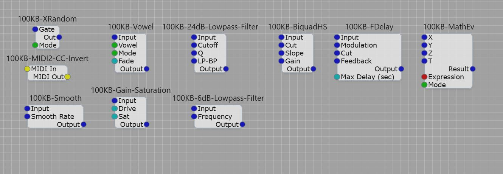

## Screenshot

  

# 100KB Modules #
Just Having Some Fun

## Modules

### **100KB-BiquadHS** – High-Shelf EQ
Voltage-controlled high-shelf filter. Boost/cut highs with Cutoff, Slope (Q), and Gain controls.

### **100KB-FDelay** – Modulated Delay
Flexible delay (up to 10s) with audio-rate modulation, feedback, and lowpass filter. Great for echoes, chorus, flanger & dub.

### **100KB-MathEv** – Math Expression Evaluator
Real-time mathematical expression parser. Supports variables, functions, and advanced modulation. Mode for SynthEdit available.

### **100KB-Smooth** – Signal Smoother
Prevents clicks/zipper noise. Ideal for portamento, glide, and smoothing automation or CV.

### **100KB-Vowel** – Formant Filter
10th-order IIR vowel filter (A/E/I/O/U). Direct or smooth crossfade modes. Perfect for vocal textures and formant morphing.

### **100KB-XRandom** – Wavetable Noise
64K noise generator with Continuous, Gated, and Mixed modes. Deterministic but excellent for percussion and textures.

### **100KB-6dB-Lowpass-Filter** – Gentle Lowpass
Simple one-pole (6dB/oct) lowpass. Very light CPU. Ideal for smoothing CV and subtle filtering.

### **100KB-24dB-Lowpass-Filter** – Analog-Style Filter
4-pole 24dB/oct lowpass with resonance and LP/BP morph. Warm, musical character.

### **100KB-Gain-Saturation** – Soft Saturator
Smooth cubic waveshaper. Adds warmth and grit with Drive & Saturation controls.

### **100KB-MIDI2-CC-Invert** – CC Inverter
Inverts MIDI Control Change values (255 - original) while passing other messages through.

---
**Note:** All modules are optimized for efficiency with built-in denormal prevention where applicable.
